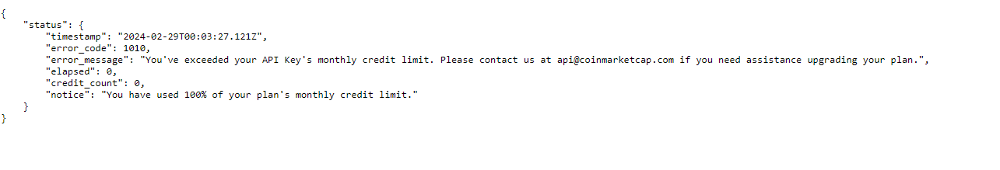

# Instructions

Thank you for expressing your interest in joining our company. We appreciate your enthusiasm and passion for this innovative technology. At our company, we value talented individuals like yourself who are dedicated to pushing the boundaries of blockchain development. You will have the opportunity to work on cutting-edge projects and collaborate with a team of experienced professionals in the field. We believe in fostering a creative and collaborative environment where ideas can flourish and new solutions can be developed.

To assist you in this role, we have prepared a quick testing environment that closely resembles the production environment. This will allow you to simulate your skills.
<https://drive.google.com/file/d/1m1-QuPFAicduj6aLuADms85ugrqidHRU/view?usp=sharing> node version is 16.
Task:

- Fix register and login issue.
- Add current Eth price on profile page.
- Add Wallet connect on profile page.

Should you have any questions or require any assistance during the testing phase, please do not hesitate to reach out to me.
Additionally, please document any bugs, glitches, or areas for improvement that you encounter during the testing process. You can upload the fixed project on your github and can send me your github repo link.
We will review and then it is perfect, you will take interview with CTO.
Thank you once again for your contribution to our blockchain development efforts. We look forward to reviewing your findings and working together to deliver a robust and reliable blockchain solution.

# Solution

Firstly, thank you for giving me this opportunity to present my work.

Here is what to address the three tasks:

## Fix register and login issue

Tried to register with my email. After hitting the "Send" button nothing happened. Inspecting the chrome developer console reveals CORS is blocking the request. 

Edited the env.js file to point to the local backend. 
After this the interface does respond with a notification, but it is a "Fail!" notification. 

The backend reported the following error:

Did some research into nodemailer. Didn't trust the credentials given with the project (.env file in the backend folder), so tried with my own google account. That resolved the issue and the email was successfully sent. 
At some point I also realized that the backend queries a database to check if the user exists, so I fired up my XAMPP and imported the database from new_mgldefi.sql file in the db folder. Had to change utf8mb4_0900_ai_ci collation to utf8mb4_unicode_ci though, since I'm working on a Windows machine (😓).

After that, it was easy sailing.

## Add current Eth price on profile page

Solution in this PR: [Pull request](https://github.com/tculig/infobipskilltest/pull/1)  

Please note that I again had to use my personal coinmarketcap credentials because the one supplied in the .env file had used up the montly quota.

## Add Wallet connect on profile page

Solution in this PR: [Pull request](https://github.com/tculig/infobipskilltest/pull/2) 

Went with the simple solution of resuing a button and redirecting to an existing page:

Takes the user to here:

Verified that it succesfully changes the wallet:

Note: These two PRs will have merge conflicts, so here's a branch with the resolution [Conflict resolved](https://github.com/tculig/infobipskilltest/tree/resolve-merge-conflict)

# General thoughts and comments

Hopefully this work is satisfactory and you will consider me for your team.

On the topic of "please document any bugs, glitches, or areas for improvement that you encounter during the testing process."

There's a lot that can be written here, and would be hard to go through everything without sounding like a smartass. 
This is clearly an older project, and has not been updated in several years. As such, its perfectly functional.

If I were to bring it to the "bleeding edge", I'd rewrite it to React 18 (allthough, from what I've heard last few days about upcoming React 19, I'd actually hold of until that's released). I would also introduce Typescript to the repo. 
There's a whole bunch of unused variables, uneven formatting. Could use with some linting and styling, but that's neither here nor there.
Finally, node version should be bumped to at least v18 in my opinion. Security support for v16 ended on 11 Sep 2023. 

Also not sure if its part of the test (probably is), there were some random "Object" declarations in the components/providers/UserProvider.js file. And there's also an undefined function called "getTokenBaseInfo" in the backend/src/utils/wallet.utils.js, but the backend never crashed because of it (which I'm sure it would at some point). Finally, a "const" was missing on line 21 in backend/src/utils/common.utils.js.

I'll end it there.

Please let me know if you need anything else!

Best,

Tiho [Linkedin](https://www.linkedin.com/in/tihomir-c-b4a12542/) 

